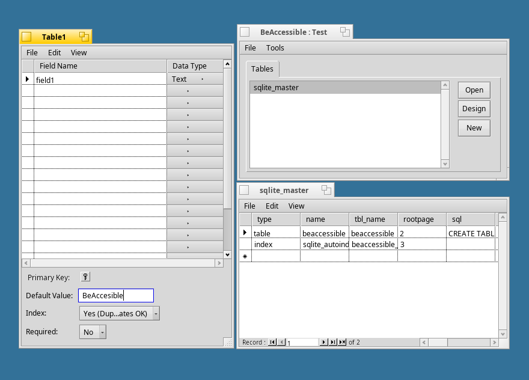

# BeAccessible
### A database viewer and editor, by randar

### How to build
Simply navigate to the `src` directory and run `make`.

### Notes
One of the 2 versions of this code is included in this repository.

* **This repository's `src` directory contains the most recent code**, with unreleased (and probably buggy) features.  It is based on SQLite v3. The main new features are the ability to import files and the ability to filter data in a table (by right-clicking in a cell and selecting "Filter For...").

* The "BeAccessible_041804.zip" file, **not included in this repository**, contains the code from the last release which was in April 2004 (see http://www.bebits.com/app/3613).  This version was (relatively) stable and was based on SQLite 2.8.11.
